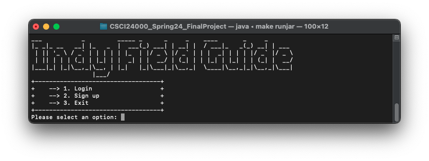
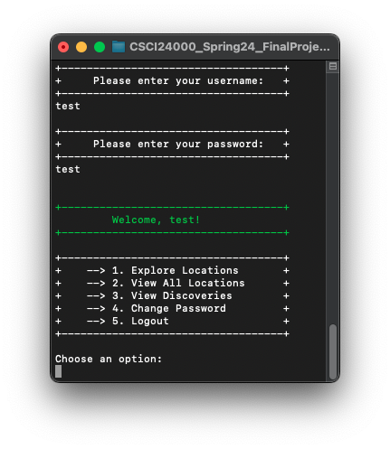

# Indy Field Guide

[](https://java.com)
[](https://opensource.org/licenses/MIT)

This project is a Java based Command Line Interface (CLI) application that takes design inspiration from Model View Controller architecture. The general concept is a field guide for the Greater Indianapolis region. Users can create an account or log in to explore various locations and species. When exploring a location, the user receives a quiz and if answered correctly, this species is added to their field guide.

## Table of Contents
- [Installation](#installation)
- [Usage](#usage)
- [Features](#features)
- [Screenshots](#screenshots)
- [Contributing](#contributing)
- [License](#license)

## Installation

### Prerequisites
Before starting, ensure you have Java installed on your system. You can check this by running `java --version` in your command prompt or terminal.
If Java is not installed, follow the [installation instructions](https://java.com/en/download/help/download_options.html).

### How to Run Locally:

```
First clone down the repo:
git clone https://github.com/qpedrick/IndyFieldGuide.git
cd IndyFieldGuide
```

### How to Use the Makefile:
After cloning, the project features a make file with a variety of commands to make running easy - you can run `make help` to list them or reference here:

```
make           : Compiles all java source files
make run       : Runs the main application
make jar       : Creates a jar file from compiled classes
make runjar    : Runs the jar file
make clean     : Removes all compiled files and the jar
make cleanData : Removes all data files
make help      : Displays this help
```

### Manual Compilation and Execution
If you prefer to not use the make file, you can compile and run by using these commands:

```
mkdir -p target
javac -d target -cp target -sourcepath src $(find src -name '*.java')
java -cp target FieldGuide.Main
```

- `mkdir -p target` : makes a directory named target if it does not exist
- `javac -d target -cp target -sourcepath src $(find src -name '*.java')` : compiles all .java files in the src directory into the target directory
- `java -cp target FieldGuide.Main` : runs the compiled program

## Usage
### Getting Started
- Start the application using `make run` or `make runjar`
### Main Menu Options
1. ***Login***: enter your information if you have previously signed up - all previous information will be loaded
2. ***Signup***: create a new user to save  your progress
3. ***Exit***: quits application
### After Login/Signup
- Authenticated User Menu will be presented:
1. ***Explore Locations***: A random location is selected for you to explore
2. ***View All Locations***: All locations will be presented with their information
3. ***View Discoveries***: Shows any species you have discovered
4. ***Change Password***: An option to update your password
5. ***Logout***: Saves state and returns to Main menu
### Location Menu
- After choosing Explore Locations a Location Menu is shown:
1. ***Discover a species***: a quiz is launched, guess correctly to 'discover' the species
2. ***Learn about this location***: shows more information about the current location
3. ***Exit***: returns to previous menu
### Species Discovery Quiz
- A question is shown with 4 answers, enter the number of your guess
- If correct, the species is added to your discovered species

## Features
- User authentication (signup and login)
- Interactive quizzes to discover some of the species present at Indianapolis Water and Land locations
- Persistent data storage using serialization
- Rich command line interface utilizing formatted, interactive menus
- Modular design that can be extended or modified for an MVC backend or headless server

## Screenshots
<details>
    <summary><strong>click me to expand</strong></summary>
    <p>
        <figure>
            <figcaption>Greeting Menu</figcaption>
            
        </figure>
        <figure>
            <figcaption>Authenticate User Menu</figcaption>
            
        </figure>
        <figure>
            <figcaption>Explore Location Menu</figcaption>
            
        </figure>
        <figure>
            <figcaption>View All Locations</figcaption>
            
        </figure>
        <figure>
            <figcaption>Example of a Quiz</figcaption>
            
        </figure>
    </p>
</details>

### UML
<figure>
    <figcaption>UML Diagram</figcaption>
    
</figure>

## Contributing

Thank you for your interest in contributing to the Indy Field Guide! We welcome contributions from everyone and value your input and support. Here’s how to contribute:

1. **Fork the Repository**
   - Start by forking the repository to your own GitHub account. This creates a copy of the project that you own and can edit freely.

2. **Clone the Repository**
   - After forking, clone the repository to your local machine to start making changes. Use the command:
    ```
    git clone https://github.com/qpedrick/IndyFieldGuide.git
    ```
3. **Create a New Branch**
   - Navigate into the project directory:
    ```
    cd IndyFieldGuide
    ```
   - Create a new branch for your feature or fix:
    ```
    git checkout -b feature/YourFeatureName
    ```

4. **Make Changes and Commit**
   - Make the necessary changes or additions to the project.
   - Commit your changes with a clear and descriptive message:
    ```
    git commit -am 'Add a brief description of your changes'
    ```

5. **Push Changes to GitHub**
   - Push your changes to your forked repository:
    ```
    git push origin feature/YourFeatureName
    ```

6. **Submit a Pull Request**
   - Go to the original repository on GitHub.
   - You’ll see a ‘Compare & pull request’ button for your branch. Click it to start the process.
   - Provide a title and description for your pull request explaining the changes you've made.

7. **Await Review**
   - Once submitted, maintainers of the project will review your pull request. Be open to any suggestions and provide additional information if required.

For more detailed instructions on contributing to open source projects, you might find this guide useful: [How to Contribute to Open Source](https://opensource.guide/how-to-contribute/).

## License
This project is licensed under the MIT License - see the [LICENSE.md](LICENSE.md) file for details.